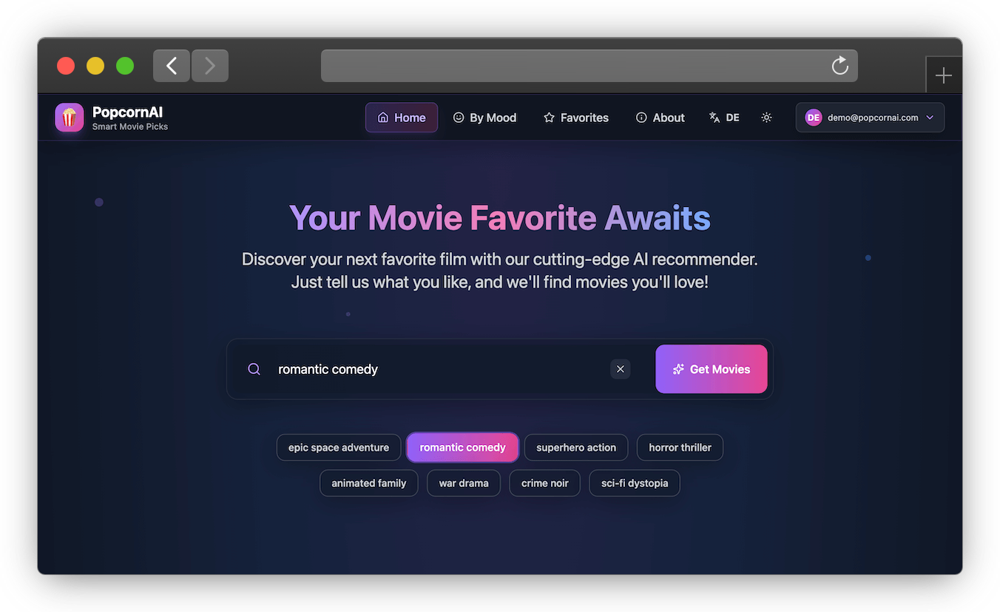

# 🎬 PopcornAI: AI Movie Recommender

Discover your next favorite movie with AI-powered recommendations! This app helps you find movies based on your mood, preferences, and personalized picks.



## ✨ Features

- 🤖 AI-powered movie recommendations
- 🔍 Smart search functionality by mood, tags and more
- � Save your favorites (with authentication)
- 🌍 Multi-language support (English & German)
- 🎨 Dark/Light theme
- 🧪 Comprehensive testing with Vitest & React Testing Library

## 🚀 Quick Start

1. **Clone and install:**

```bash
git clone https://github.com/jukoor/ai-movie-recommender.git
cd ai-movie-recommender
npm i
```

2. **Set up environment variables:**

```bash
# Copy the example environment file
cp .env.example .env
```

Then edit `.env` and add your API keys:

- **TMDB API**: Get your key from [TMDB API Settings](https://www.themoviedb.org/settings/api)
- **Firebase**: Get your config from [Firebase Console](https://console.firebase.google.com/)
- **OpenRouter**: Get your key from [OpenRouter Keys](https://openrouter.ai/keys)

3. **Run the app:**

```bash
npm run dev
```

That's it! Open `http://localhost:5173` in your browser.

> **Note:** This now runs both the Vite dev server and the Express API server concurrently. See [LOCAL-DEV-SETUP.md](LOCAL-DEV-SETUP.md) for more details.

## 🛠️ Built With

- React 19 + TypeScript
- Tailwind CSS + Flowbite
- Firebase Authentication
- TMDB API
- OpenAI API

## 🧪 Testing

Run tests with:

```bash
npm test              # Run tests in watch mode
npm run test:ui       # Run tests with visual UI
npm run test:coverage # Generate coverage report
```

See [TESTING.md](./TESTING.md) for detailed testing guidelines and examples.

## 📄 License

MIT License - feel free to use this project however you like!
